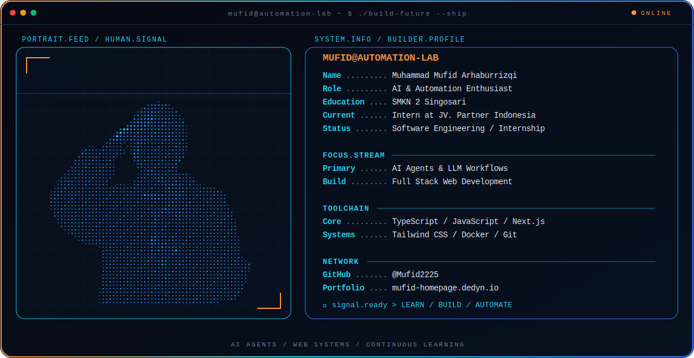

  <picture>
    <source media="(max-width: 760px) and (prefers-color-scheme: dark)" srcset="./assets/hero/mufid-console-mobile-dark.svg">
    <source media="(max-width: 760px)" srcset="./assets/hero/mufid-console-mobile-light.svg">
    <source media="(prefers-color-scheme: dark)" srcset="./assets/hero/mufid-console-dark.svg">
    <source media="(prefers-color-scheme: light)" srcset="./assets/hero/mufid-console-light.svg">
    
  </picture>

  
  

## About Me

I am **Muhammad Mufid Arhaburrizqi**, a Software Engineering student at **SMKN 2 Singosari**, currently gaining industry experience at **JV. Partner Indonesia**.

I am a frontend-focused developer building responsive interfaces with React, Next.js, TypeScript, and Tailwind CSS. Through practical projects, I also explore Electron desktop applications, backend and database systems, and AI-powered automation.

Based in **Malang, East Java, Indonesia** · Indonesian and English

> Open to collaboration and frontend project opportunities.

## Current Focus

| Area | What I am building and exploring |
| --- | --- |
| **Frontend Products** | Responsive Next.js experiences through projects such as RuangTeduh and Aligatour. |
| **Desktop Applications** | Electron and SQLite workflows for checkout, inventory, shifts, and reporting through Kasir-App. |
| **Backend Systems** | Go, Gin, MariaDB, Redis, and transactional application logic through SiPena. |
| **AI & LLM Workflows** | Multi-provider routing, smart fallback, token compression, and automation through 9Router. |

## Featured Projects

| Project | Description | Stack | Links |
| --- | --- | --- | --- |
| **Kasir-App** | Desktop point-of-sale system for Indonesian stores and SMEs, covering checkout, inventory, shifts, reports, and QRIS payments. | Electron, Next.js, TypeScript, SQLite | [Source](https://github.com/Mufid2225/kasir-app) |
| **RuangTeduh** | Mood-based coffee shop discovery experience with a responsive neo-brutalist interface. | Next.js, TypeScript, Tailwind CSS, Supabase | [Source](https://github.com/Mufid2225/ruangteduh) |
| **Aligatour** | Responsive tour catalog with detailed services, SEO metadata, and WhatsApp reservations. | Next.js, TypeScript, Tailwind CSS, Netlify | [Live](https://aligatour.netlify.app/) · [Source](https://github.com/Mufid2225/aligatour) |
| **SiPena** | Digital academic permit system built as a full-stack collaboration for school administration workflows. | Next.js, Go, Gin, MariaDB, Redis | [Live](https://www.sipena-smkn2.dedyn.io/) |
| **9Router** | OpenAI-compatible AI router with multi-provider routing, smart fallback, and token compression. | Next.js, Express, SQLite | [Live](https://neriss4-9router-database-demo.hf.space/) · [Source](https://huggingface.co/spaces/Neriss4/9router-database-demo/tree/main) |

## Tech Stack

### Frontend

  
  
  
  
  

### Application & Backend

  
  
  
  

### Data & Infrastructure

  
  
  
  
  
  
  

## Contact

- **Email:** [mufidarhaburizky@gmail.com](mailto:mufidarhaburizky@gmail.com)
- **Portfolio:** [mufid-homepage.dedyn.io](https://www.mufid-homepage.dedyn.io/)
- **GitHub:** [@Mufid2225](https://github.com/Mufid2225)
- **Instagram:** [@fidnotpid_](https://www.instagram.com/fidnotpid_/)

---

Learning, building, and automating one useful system at a time.

